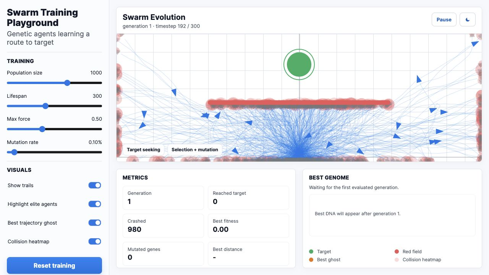

# Swarm Training Playground

Standalone browser playground for watching a population of agents learn to navigate targets, obstacles, trails, and heatmaps.

## Live Demo

[Open the Vercel deployment](https://swarm-xi-eight.vercel.app)



## Features

- Agent swarm simulation with target seeking and obstacle avoidance.
- Tunable population, mutation, speed, and visualization layers.
- Live canvas rendering with trails, heatmaps, and performance metrics.
- Single-file static app, deployable anywhere that serves HTML.

## Run Locally

```bash
python3 -m http.server 8772
```

Then open:

```text
http://localhost:8772
```

## Project Structure

```text
index.html       Full standalone simulator
docs/            README screenshot assets
```
